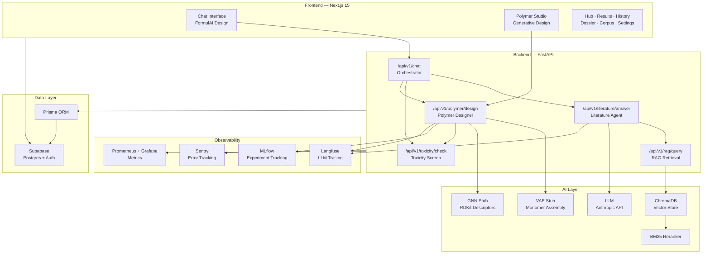
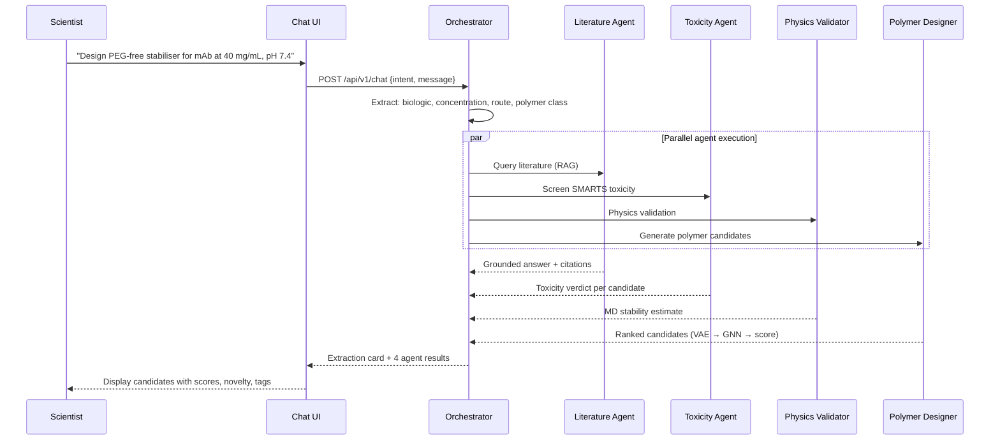
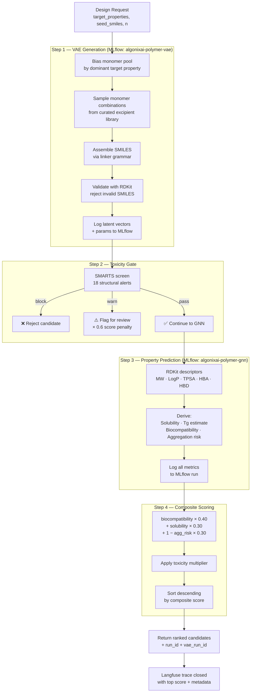
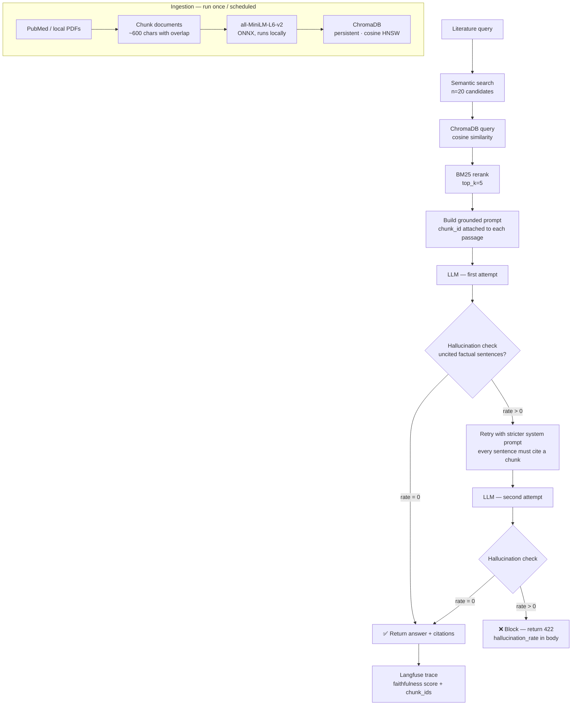

# AlgonixAI — Biologics Stabilisation Platform

> AI-driven polymer excipient design for biologics formulation scientists. From natural-language intent to ranked, toxicity-gated polymer candidates — with full observability.

AlgonixAI automates the most time-consuming parts of biologics formulation: literature retrieval, excipient screening, polymer generation, and safety gating. A scientist describes what they need in plain English; the platform returns ranked polymer candidates grounded in peer-reviewed literature, with toxicity flags, physicochemical predictions, and an audit trail traceable to every source document.

---

## Table of Contents

- [Overview](#overview)
- [Architecture](#architecture)
- [AI Pipelines](#ai-pipelines)
  - [Chat Agent Pipeline](#chat-agent-pipeline)
  - [Polymer Generative Design](#polymer-generative-design)
  - [RAG + Literature Agent](#rag--literature-agent)
- [Technology Stack](#technology-stack)
- [Project Structure](#project-structure)
- [Getting Started](#getting-started)
- [Environment Variables](#environment-variables)
- [API Reference](#api-reference)
- [Observability](#observability)
- [Roadmap](#roadmap)

---

## Overview

Biologics formulation requires stabilising proteins — monoclonal antibodies, enzymes, vaccines — against aggregation, denaturation, and degradation. Choosing the right polymer excipient is expensive and slow: scientists spend weeks scanning literature, synthesising candidates, and running assays.

AlgonixAI compresses that cycle:

| Without AlgonixAI | With AlgonixAI |
|---|---|
| Manual PubMed searches (days) | RAG-grounded answers in seconds |
| Empirical trial-and-error screening | Generative polymer candidates ranked by composite score |
| No safety gate until wet-lab | SMARTS-based toxicity screen before any synthesis |
| Scattered experiment records | Full MLflow + Langfuse audit trail |

---

## Architecture



---

## AI Pipelines

### Chat Agent Pipeline

The chat interface uses a four-agent state machine. The user submits a natural-language formulation intent; the platform extracts structured parameters, then runs all four agents concurrently.



### Polymer Generative Design

The polymer design pipeline runs on every `/api/v1/polymer/design` call. It is deterministic by `run_id` so results are fully reproducible.



### RAG + Literature Agent

Literature retrieval uses a two-stage hybrid: dense semantic search first, then BM25 lexical reranking. Every answer is hallucination-gated — any uncited factual claim triggers a retry with a stricter prompt.



---

## Technology Stack

### Frontend
| Layer | Technology |
|---|---|
| Framework | Next.js 15 (App Router) |
| Language | TypeScript |
| Styling | Tailwind CSS + inline design tokens |
| Auth | Supabase Auth |
| ORM | Prisma |
| Error tracking | Sentry |
| Fonts | Plus Jakarta Sans · JetBrains Mono · Space Grotesk · Space Mono |

### Backend
| Layer | Technology |
|---|---|
| Framework | FastAPI 0.115 |
| Language | Python 3.11+ |
| Validation | Pydantic v2 |
| Chemistry | RDKit (toxicity SMARTS, property descriptors) |
| LLM | Anthropic API |
| Vector store | ChromaDB 1.5 (local persistent, cosine HNSW) |
| Embeddings | all-MiniLM-L6-v2 (ONNX, runs locally — no API key) |
| Reranking | BM25Okapi (`rank-bm25`) |
| LLM tracing | Langfuse |
| Experiment tracking | MLflow |
| Metrics | Prometheus + Grafana Alloy |
| Error tracking | Sentry |

### Infrastructure
| Component | Technology |
|---|---|
| Database | Supabase (Postgres) |
| Auth | Supabase Auth |
| Monitoring | Grafana Cloud (via Alloy remote write) |

---

## Project Structure

```
algonixai/
├── api/                             # FastAPI backend
│   ├── main.py                      # App entrypoint, routes, middleware
│   ├── literature_agent.py          # RAG + LLM + hallucination gate
│   ├── polymer_designer.py          # VAE → toxicity gate → GNN → scoring
│   ├── toxicity.py                  # SMARTS-based toxicity screen (18 alerts)
│   ├── rag.py                       # ChromaDB semantic search + BM25 rerank
│   ├── ingest.py                    # Generic document ingestion
│   ├── ingest_pubmed.py             # PubMed-specific ingestion pipeline
│   └── requirements.txt
│
├── web/                             # Next.js 15 frontend
│   ├── app/
│   │   ├── (auth)/                  # Sign-in / sign-up pages
│   │   ├── (onboarding)/            # First-run onboarding flow
│   │   ├── api/                     # Next.js API routes (proxy to FastAPI)
│   │   │   ├── chat/route.ts
│   │   │   ├── polymer/route.ts
│   │   │   └── health/route.ts
│   │   ├── chat/page.tsx            # Chat interface (4-agent pipeline)
│   │   ├── polymer-studio/page.tsx  # Generative design UI
│   │   ├── hub/page.tsx             # Dashboard
│   │   ├── results/page.tsx
│   │   ├── history/page.tsx
│   │   ├── dossier/page.tsx
│   │   ├── corpus/page.tsx
│   │   ├── settings/page.tsx
│   │   ├── monitoring/page.tsx
│   │   └── profile/page.tsx
│   ├── components/
│   │   ├── Sidebar.tsx              # Global navigation sidebar
│   │   └── AppShell.tsx             # Layout wrapper
│   ├── lib/
│   │   ├── prisma.ts                # Prisma client singleton
│   │   ├── supabase.ts              # Supabase browser client
│   │   └── supabase-server.ts       # Supabase server client (RSC)
│   └── prisma/
│       └── schema.prisma            # Database schema
│
└── monitoring/
    └── alloy/config.alloy           # Grafana Alloy Prometheus remote write config
```

---

## Getting Started

### Prerequisites

- Node.js 20+
- Python 3.11+
- A Supabase project (free tier works)
- An Anthropic API key

### 1. Clone and install

```bash
git clone https://github.com/otunmartins/algonixai.git
cd algonixai
```

**Backend:**
```bash
cd api
python -m venv .venv
source .venv/bin/activate      # Windows: .venv\Scripts\activate
pip install -r requirements.txt
```

**Frontend:**
```bash
cd web
npm install
```

### 2. Configure environment variables

See [Environment Variables](#environment-variables) below. Create `api/.env` and `web/.env` with your values.

### 3. Initialise the database

```bash
cd web
npx prisma migrate deploy
```

### 4. Run the platform

**Terminal 1 — FastAPI backend:**
```bash
cd api
uvicorn main:app --reload --port 8000
```

**Terminal 2 — Next.js frontend:**
```bash
cd web
npm run dev
```

Open [http://localhost:3000](http://localhost:3000).

### 5. Ingest literature (optional but recommended)

```bash
cd api
python ingest_pubmed.py
```

---

## Environment Variables

### `api/.env`

```env
# LLM
ANTHROPIC_API_KEY=sk-ant-...

# Supabase
SUPABASE_URL=https://your-project.supabase.co
SUPABASE_SERVICE_KEY=eyJ...

# Langfuse (LLM tracing)
LANGFUSE_PUBLIC_KEY=pk-lf-...
LANGFUSE_SECRET_KEY=sk-lf-...
LANGFUSE_HOST=https://cloud.langfuse.com

# Sentry
SENTRY_DSN=https://...@sentry.io/...

# MLflow
MLFLOW_TRACKING_URI=http://127.0.0.1:5000

# ChromaDB
CHROMA_PATH=./chroma_db

# CORS
ALLOWED_ORIGINS=http://localhost:3000
ENVIRONMENT=development
```

### `web/.env`

```env
# Supabase
NEXT_PUBLIC_SUPABASE_URL=https://your-project.supabase.co
NEXT_PUBLIC_SUPABASE_ANON_KEY=eyJ...

# Sentry
SENTRY_DSN=https://...@sentry.io/...
NEXT_PUBLIC_SENTRY_DSN=https://...@sentry.io/...

# FastAPI backend
NEXT_PUBLIC_API_URL=http://localhost:8000
```

### Grafana Alloy

Set these before running Alloy:

```env
GRAFANA_PROM_USER=<your numeric user ID>
GRAFANA_PROM_TOKEN=<your Grafana Cloud API token>
```

---

## API Reference

All endpoints are prefixed `/api/v1`. Responses follow standard JSON.

| Method | Endpoint | Description |
|---|---|---|
| `GET` | `/health` | Liveness check |
| `POST` | `/api/v1/toxicity/check` | SMARTS toxicity screen for a SMILES string |
| `POST` | `/api/v1/rag/query` | Semantic + BM25 document retrieval |
| `POST` | `/api/v1/literature/answer` | RAG-grounded answer with hallucination gate |
| `POST` | `/api/v1/polymer/design` | Generate and rank polymer candidates |
| `GET` | `/metrics` | Prometheus metrics endpoint |

**POST `/api/v1/polymer/design`**

```json
{
  "target_properties": {
    "solubility": 0.8,
    "biocompatibility": 0.9,
    "biodegradable": false
  },
  "seed_smiles": "OCCO",
  "n_candidates": 5,
  "constraints": { "max_mw": 5000 }
}
```

**POST `/api/v1/literature/answer`**

```json
{
  "query": "What polymers suppress mAb aggregation at low pH?",
  "top_k": 5
}
```

---

## Observability

| Tool | What it tracks |
|---|---|
| **Sentry** | Runtime exceptions, API errors, frontend crashes |
| **Langfuse** | Every LLM call — input/output, latency, hallucination rate |
| **MLflow** | VAE + GNN experiment runs, candidate metrics, reproducibility |
| **Prometheus** | HTTP request rate, latency histograms, error rates |
| **Grafana** | Dashboards pulling from Prometheus remote write |

Every polymer design run produces a `run_id` and `vae_run_id` that can be queried in MLflow to reproduce results exactly.

---

## Roadmap

- [ ] Live physics validation via OpenMM on RunPod GPU
- [ ] CSO Agent — automated clinical safety review
- [ ] Evidently AI data drift monitoring
- [ ] Evaluation regression suite (automated golden-set benchmarks)
- [ ] Replace VAE stub with trained decoder weights
- [ ] Replace GNN stub with fine-tuned graph neural network
- [ ] PubMed scheduled ingestion (weekly cron)
- [ ] Multi-user workspace isolation

---

## License

MIT
